# 💭 Dreamtopia - 면접 & 진로 LangGraph RAG 서비스

## 👥 팀 소개
| 이름 | 역할 | GitHub |
| --- | --- | --- |
| <br>김준규 (팀장) | Django, finetuning, README | [@JungyuOO](https://github.com/JungyuOO) |
| <br>김규리 | LangGraph 설계 및 개발, RAG(college), README | [@GyuriKimm](https://github.com/GyuriKimm) |
| <br>김민주 | RAG(college), LangGraph 노드 개발, README | [@kmjj0801](https://github.com/kmjj0801) |
| <br>김수미 | LangGraph 노드 개발, README | [@ghyeju0904](https://github.com/ghyeju0904) |
| <br>김영우 | LangGraph 노드 개발, README | [@youngwookim1006](https://github.com/youngwookim1006) |
| <br>임승옥 | RAG(interview), finetuning, Figma, README | [@SeungOk00](https://github.com/SeungOk00) |


## 🤖 서비스 목표: 
>면접 질문 추천 + 대학 진로 상담을 한 번에 처리하는 LangGraph 기반 멀티 파이프라인 RAG  기반 챗봇 시스템 제공 

> Ollama + OpenAI + pgvector 조합으로, 질문 도메인 및 질문 유형에 따라 분기되어 가장 적합한 근거를 찾아 신뢰할 수 있는 답변 제공

## 프로젝트 요약 :
**핵심 아이디어**
>  - LangGraph로 **면접 vs 대학 진로**를 라우팅 → 각 도메인별 최적 전략 적용
>  - pgvector + HuggingFace 임베딩으로 **근거가 남는 검색** 수행
>  - 질문 성격에 따라 **SQL 필터 + 벡터 검색 + LLM 평가**를 조합
>  - **모델 스택:** Ollama `gemma3:1b`(분류/재작성), OpenAI `gpt-4o(-mini)`(평가/생성), `text-embedding-3-large` 임베딩


## 🧠 배경
>  교육부와 통계청 자료에 따르면 매년 약 45만 명의 수험생이 대학 진학을 준비하고, 70만 명 이상의 청년층 취업준비생이 면접 경쟁에 뛰어들고 있음.

> **수험생 규모**
> - 2024학년도 대학수학능력시험 응시생 수: 444,870명
> - 출처 : 교육부 공식 블로그(https://if-blog.tistory.com/14688)

> **취업준비생 규모** 
> - 최근 고용동향 기준 취업준비자는 연간 60만 명 이상
> - 출처 : 통계청, 「2025년 6월 고용동향」, https://mods.go.kr/board.es?mid=a10301030200&bid=210&act=view&list_no=437607 
      

## 현재 시스템의 문제점
> 1. 정보 파편화·신뢰도 문제
> - 학과 정보, 진로 데이터, 기업 면접 질문, 합격자 후기가 대학·정부 문서, 커뮤니티, 채용 공고 등 비정형 자료에 흩어져 있어 한 번에 찾기 어렵고, 정보의 신뢰도·일관성이 떨어짐.
> 2. 빠르게 변하는 내용의 업데이트 부족
> - 전형 변화, 학과 커리큘럼 개편, 기업·직무별 면접 트렌드, 산업별 요구 역량 등이 빠르게 바뀌지만 이를 체계적으로 정리·업데이트해 주는 플랫폼이 거의 없음.
> 3. 정보 접근성과 상담 품질의 격차
> - 학력·전공·지역·경제적 여건에 따라, 특히 컨설팅을 받기 어려운 학생·비수도권 거주자·고액 학원·컨설팅이 부담되는 취준생일수록 ‘검증된 정보’와 ‘구체적인 피드백’에 접근하기 어려운 구조적 격차가 발생함.


## 📌 제공하는 서비스 

| 구분               | 취업 영역 (면접)                                             | 대학 영역 (진학)                                                   |
| ------------------ | ------------------------------------------------------------ | ------------------------------------------------------------------ |
| **주요 대상**        | 취업준비생, 이직 준비자                                         | 고등학생, N수생, 대학(전과·편입) 준비생                                 |
| **제공 정보 범위**     | 직무별 면접 질문, 답변 패턴, 예상 질문 등 **면접 준비 정보**         | 대학/학과 정보, 커리큘럼·진로, 전형 구조·지원 전략 등 **대학·진학 정보** |
| **핵심 기능**        | 지원 직무 기반 **예상 질문 추천**, 답변 **구조·논리·톤 피드백**, 모범 답변·개선안 제공 | 성적·관심 계열 기반 **학과·대학 추천**, 전형별 **지원 전략 제안**, 활동 계획 컨설팅 |
| **역할 정의**        | **AI 면접 코치**: 답변 퀄리티 향상에 초점을 맞춘 면접 전담 코치         | **AI 진학 컨설턴트**: 대학/학과 정보와 진학 전략을 함께 제시              |
| **RAG 활용 포인트**   | 면접 Q&A 기반 검색으로 질문 추천 및 답변 피드백 제공                 | 대학 안내문·통계·전형 문서 기반 검색으로 학교·전형별 근거 제공            |


## 🔍 서비스 이점 및 차별성

| 항목 | 기존 취업 서비스 (면접) | 기존 대학 서비스 (진학) | 제안 서비스 (우리) |
| --- | --- | --- | --- |
| 제공 범위 | 직무별 면접 질문·답변 나열 중심 | 대학/학과 정보와 전형 상담 | 진학 정보 + 면접 준비를 하나의 여정으로 통합 |
| 피드백 깊이 | 질문 리스트 제공 수준, 답변 퀄리티는 개인 몫 | 진학 방향·전형 전략 중심 | AI 코치가 답변 구조·논리·길이까지 피드백 |
| 기술적 특징 | 게시판/검색형 정보 제공 | 상담 챗봇·FAQ | RAG 기반 근거 제시 + 도메인 라우팅으로 신뢰도/적합도 강화 |
| 역할 | 면접 정보 제공자 | 진학 상담 제공자 | 진학부터 면접까지 케어하는 AI 진로·면접 코치 |

---

## ✨ 핵심 기능

> System Architecture
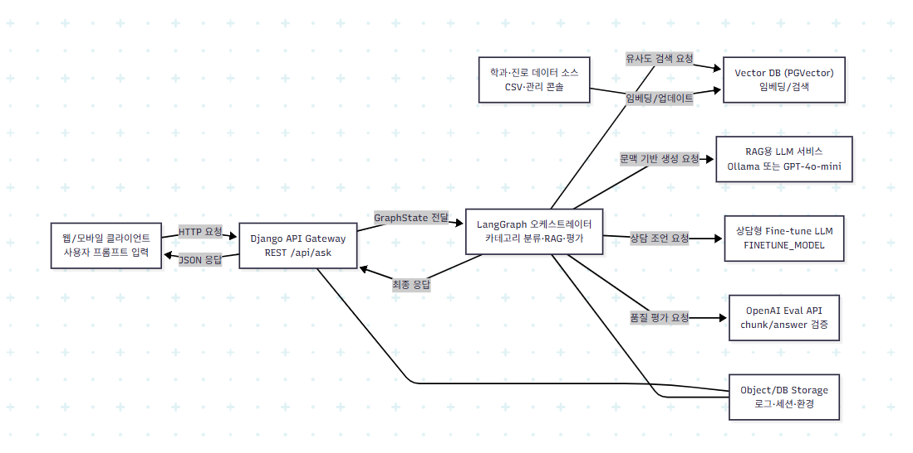

위 다이어그램은 Dreamtopia의 전체 시스템 아키텍처입니다. 사용자 요청이 Django API Gateway를 통해 LangGraph 오케스트레이터로 전달되고, Vector DB에서 유사도 검색을 수행한 후 LLM을 통해 최종 응답을 생성하는 과정을 시각화합니다.

- **LangGraph 멀티 라우팅**
  - `classify` 노드로 면접/대학/기타 분류
  - 대학 진로 파이프라인 내부에서 `rag` vs `finetune` 경로 추가 분기
- **면접 파이프라인**
  - 정규식 기반 `interview_query_classify` agent로 질문 추천 vs 답변 피드백 판별
  - 면접 질문 추천 -> 키워드로 occupation/question_intent를 추출해 **SQL 필터 → 벡터 검색**
  - 답변 피드백 -> **벡터 검색**
  - 청크 관련도는 `interview_eval` agent에서 OpenAI 평가 모델을 사용해서 JSON으로 스코어링 후 상위 청크만 사용
  - `interview_generation` 노드가 질문 추천 리스트 또는 답변+포인트+추가 연습문제까지 생성
  
- **대학 진로 파이프라인**
  - `CustomPGVector`에 학과별 chunk 저장
  - 청크 재평가(`evaluate_chunks`) + 답변 생성(`generate_answer`) + 2차 검수(`evaluate_answer`)
  - 고민 상담형 질문은 추후 연결할 파인튜닝 모델로 라우팅할 수 있게 구조화
- **질문 재작성 & 재검색**
  - 면접 질문 추천이며 점수가 낮으면 `generate_user_question_node`가 질문을 재작성 후 재검색
- **Django UI**
  - `/chatbot/chat_v3.html`에서 프로필(단계/관심사)를 입력하면 LangGraph 흐름 호출
  - `/chatbot/ask` API는 JSON으로 결과를 반환해 다른 채널에서도 재사용 가능


## 🧰 기술 스택

| 범주 | 기술 | 설명 |
|------|------|------|
| **LLM** | Ollama `gemma3:1b`<br>OpenAI `gpt-4o`, `gpt-4o-mini` | 분류/재작성: Ollama<br>평가/생성: OpenAI |
| **Embedding** | OpenAI `text-embedding-3-large` | 3072차원 벡터 임베딩 |
| **RAG Framework** | LangGraph | 노드 기반 워크플로우 오케스트레이션 |
| **Vector DB** | PostgreSQL 16 + pgvector | 벡터 유사도 검색 + SQL 필터링 |
| **Backend** | Python 3.11, LangChain, Django 5.2 | API 서버 + LangGraph 통합 |
| **Frontend** | Django Templates + Vanilla JS | 서버 사이드 렌더링 + 동적 UI |
| **Containerization** | Docker + Docker Compose | 전체 시스템 컨테이너화 및 오케스트레이션 |
| **Monitoring** | LangSmith (Optional) | LLM 호출 추적 및 디버깅 |

---

## 📚 데이터 & 라이선스
| 구분 | 출처 | 비고 | 링크 |
| --------- | --- | --- | --- |
| 대학/전공 정보 | CareerNet/교육부 공개자료에서 정제된 `major_details_*.csv` | 학과 특성, 진로, 적성, 관련 직업 | https://www.data.go.kr/data/15014632/fileData.do?recommendDataYn=Y, https://www.career.go.kr/cloud/m/major/uList
| 면접 데이터 | 자체 크롤링 및 인터뷰 스크립트 정제본 `interview_final_db.csv` | 직군(occupation), 질문 의도(question_intent) 라벨 포함 | https://www.aihub.or.kr/aihubdata/dat
| 벡터 DB | PostgreSQL + pgvector | 학과/면접 데이터 임베딩 저장 및 유사도 검색 | - |

> **Note**: RDB(PostgreSQL)와 pgvector 확장을 활용하여 학과 및 면접 데이터의 임베딩 벡터를 저장하고, 코사인 유사도 기반 시맨틱 검색을 수행

---
## 📁 폴더 구조

```
SKN18-4th-2team/
├── backend/                              # 백엔드 핵심 로직
│   ├── LangGraph/                        # LangGraph 워크플로우
│   │   ├── agent/                        # LLM 에이전트
│   │   │   ├── interview_query_classify_agent.py
│   │   │   └── interview_eval_agent.py
│   │   ├── nodes/                        # 그래프 노드
│   │   │   ├── classify.py               # 도메인 분류 (면접/대학)
│   │   │   ├── classify_rag_finetune.py  # RAG vs 파인튜닝 분류
│   │   │   ├── interview_query_classify.py
│   │   │   ├── interview_vector_search.py
│   │   │   ├── interview_eval.py
│   │   │   ├── interview_generation.py
│   │   │   ├── retrieve_chunks.py
│   │   │   ├── eval_chunks.py
│   │   │   ├── generate_answer.py
│   │   │   └── generate_questions.py
│   │   ├── graph.py                      # 메인 그래프 정의
│   │   ├── initstate.py                  # 초기 상태 설정
│   │   └── visualize_graph.py            # 그래프 시각화 유틸리티

│   │
│   ├── LLM_finetunig/                    # LLM 파인튜닝
│   │   ├── gemma31b-final.ipynb          # Gemma-3-1B 파인튜닝 노트북
│   │   ├── real_final_counseling.jsonl   # 진로 상담 학습 데이터셋
│   │   └── finetuning.md                 # 파인튜닝 가이드
│   │
│   │ 
│   ├── data_preprocessiong/              # 데이터 전처리
│   │   ├── data_preprocessiong.md        # 전처리 가이드
│   │   └── interview/                    # 면접 데이터 전처리 스크립트
│   │       ├── add_sample_id.py
│   │       ├── check_columns.py
│   │       ├── drop_columns.py
│   │       ├── filter_experienced.py
│   │       ├── json_to_csv_detailed.py
│   │       ├── make_ft_jsonl.py
│   │       ├── merge_csv.py
│   │       ├── merge_json.py
│   │       ├── run_intent_tagger_v3.py
│   │       └── unzip_and_merge.py
│   │
│   ├── service/                          # 서비스 레이어
│   │   └── main.py                       # 메인 서비스 진입점
│   │
│   ├── CustomLoader.py                   # CSV 로더 (대학 데이터)
│   ├── CustomPGvector.py                 # 대학 벡터스토어
│   ├── InterviewPGVector.py              # 면접 벡터스토어
│   ├── ingest_data.py                    # 대학 데이터 임베딩
│   ├── embed_interview_data.py           # 면접 데이터 임베딩
│   ├── models.py                         # 데이터 모델
│   └─── utils.py                         # 유틸리티 함수
│
│ 
├── django/                               # Django 웹 애플리케이션
│   ├── chatbot/                          # 챗봇 앱
│   │   ├── views.py                      # 뷰 로직
│   │   ├── urls.py                       # URL 라우팅
│   │   ├── models.py                     # 데이터 모델
│   │   ├── admin.py                      # 관리자 설정
│   │   ├── apps.py                       # 앱 설정
│   │   ├── tests.py                      # 테스트 코드
│   │   ├── backend_client.py             # 백엔드 API 클라이언트
│   │   └── migrations/                   # DB 마이그레이션
│   │
│   ├── config/                           # Django 설정
│   │   ├── settings.py                   # 프로젝트 설정
│   │   ├── urls.py                       # 메인 URL 라우팅
│   │   ├── wsgi.py                       # WSGI 설정
│   │   └── asgi.py                       # ASGI 설정
│   │
│   ├── templates/                        # HTML 템플릿
│   │   └── chatbot/
│   │       ├── index.html                # 메인 페이지
│   │       ├── chat_v2.html              # 챗봇 UI v2
│   │       └── chat_v3.html              # 챗봇 UI v3 (최신)
│   │
│   ├── static/                           # 정적 파일
│   │   └── chatbot/
│   │       ├── css/                      # 스타일시트
│   │       │   ├── base.css
│   │       │   ├── chat_v2.css
│   │       │   ├── chat_v3.css
│   │       │   └── styles.css
│   │       ├── js/                       # JavaScript 파일
│   │       │   ├── script.js
│   │       │   ├── chat_v2.js
│   │       │   ├── chat_v3.js
│   │       │   └── conversations.js
│   │       └── img/                      # 이미지 파일
│   │           └── chatbot.png
│   │
│   └── manage.py                         # Django 관리 명령
│
├── data/                                 # 데이터셋
│   ├── college/                          # 대학/전공 데이터
│   │   ├── major_details_공학.csv
│   │   ├── major_details_교육.csv
│   │   ├── major_details_사회.csv
│   │   ├── major_details_예체능.csv
│   │   ├── major_details_의약.csv
│   │   ├── major_details_인문.csv
│   │   └── major_details_자연.csv
│   │
│   └── interview/                        # 면접 데이터
│       ├── interview_final_db.csv        # 면접 메인 데이터셋
│       └── interview_ft.jsonl            # 파인튜닝용 데이터
│
├── docker/                               # Docker 설정 및 SQL 스크립트
│   ├── docker-compose.yml                # Docker Compose 설정
│   ├── Dockerfile.web                    # Django 웹 서버 Dockerfile
│   ├── web-entrypoint.sh                 # 웹 서버 시작 스크립트
│   ├── college.sql                       # 대학 DB 스키마
│   ├── interview.sql                     # 면접 DB 스키마
│   └── sql_detail.md                     # SQL 스키마 상세 가이드
│
├── images/                               # 프로젝트 이미지 리소스
│   ├── system_architecture.png           # 시스템 아키텍처 다이어그램
│   ├── lang_graph/                       # LangGraph 설계
│   ├── llm_finetuning/                   # fine-tuning score
│   ├── figma/                            # Figma 화면 설계
│   ├── teams/                            # 팀원 프로필 사진
│   └── web_page/                         # 웹 페이지 스크린샷
│      
├── .env.sample                           # 환경변수 샘플
├── requirements.txt                      # Python 의존성 패키지
└── README.md                             # 프로젝트 문서
```
---

## 🔄 RAG 설계 및 워크플로우
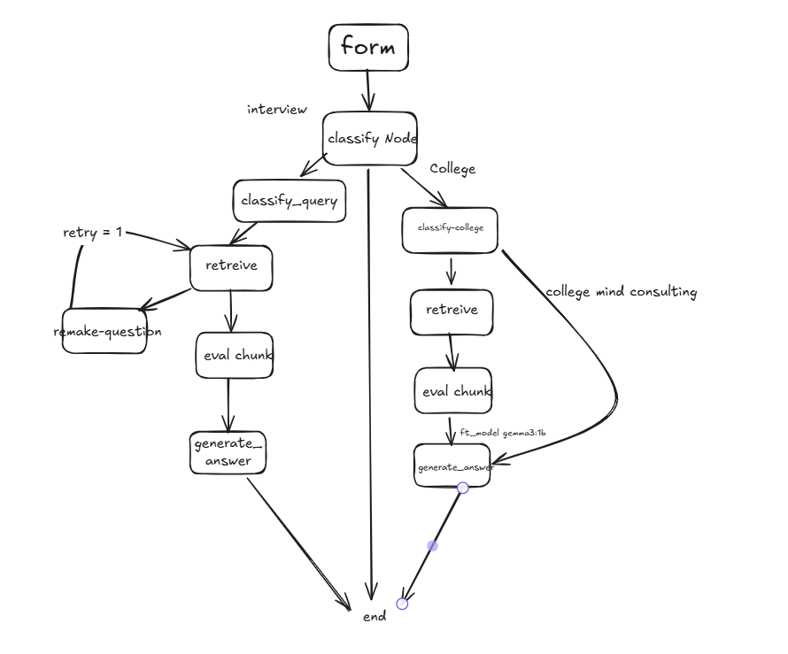

| 단계 | 노드 및 Agent | 책임 |
| --- | --- | --- |
| 분기 | `classify`, `classify_rag_finetune` | Ollama로 면접/대학/기타, RAG/파인튜닝 분류 |
| 면접 프리프로세싱 | `interview_query_classify`, `generate_user_question` | 패턴 기반 유형 판별, 질문 재작성 |
| 검색 | `interview_vector_search`, `retrieve_chunks` | SQL 필터 + pgvector 검색 |
| 평가 | `interview_eval`, `evaluate_chunks` | OpenAI 평가 모델이 청크 점수 산출 |
| 생성 | `interview_generation`, `generate_answer` | GPT-4o 계열 모델로 답변/추천 생성 |
| 검수 | `evaluate_answer` | JSON 평가 결과 기반으로 최종 답변 확정 |

### 📝 질문별 답변 생성 방식

#### 1. 면접 질문 추천
**입력 예시**: "소프트웨어 개발자 면접 질문 추천해줘"

**처리 과정**:
1. `classify` → 도메인: `interview` 판별
2. `interview_query_classify` → 유형: `question_recommendation` 판별
3. `interview_vector_search` → `occupation`, `question_intent` 필터 + 벡터 검색으로 유사 면접 질문-답변 쌍 검색
4. `interview_eval` → 검색된 청크들을 OpenAI 평가 모델로 관련도 점수화
5. `interview_generation` → 상위 청크 기반으로 면접 질문 리스트 생성

#### 2. 면접 답변 피드백
**입력 예시**: "팀 프로젝트에서 갈등을 해결한 경험에 대해 답변해줘: [사용자 답변]"

**처리 과정**:
1. `classify` → 도메인: `interview` 판별
2. `interview_query_classify` → 유형: `answer_feedback` 판별
3. `interview_vector_search` → 사용자 답변과 유사한 모범 답변 검색 (필터 없이 벡터 검색만)
4. `interview_eval` → 검색된 청크들의 관련도 평가
5. `interview_generation` → 사용자 답변 분석 + 개선 포인트 + 모범 답변 예시 제공

#### 3. 대학 진로 상담 (RAG 경로)
**입력 예시**: "컴퓨터공학과 진로가 궁금해요"

**처리 과정**:
1. `classify` → 도메인: `college` 판별
2. `classify_rag_finetune` → 방법: `rag` 선택
3. `retrieve_chunks` → `college.college_vector_db`에서 "컴퓨터공학" 관련 청크 검색
4. `generate_answer` → 검색된 학과 정보 기반으로 진로 상담 답변 생성

#### 4. 대학 진로 상담 (파인튜닝 경로)
**입력 예시**: "진로가 막막해서 고민이에요"

**처리 과정**:
1. `classify` → 도메인: `college` 판별
2. `classify_rag_finetune` → 방법: `finetune` 선택 (감정적/일반적 상담 질문)
3. `generate_answer` → 파인튜닝된 Gemma-3-1B 모델로 공감적 상담 답변 생성
---

## 🔍 LangSmith 모니터링


---

## 📊 LLM Fine-tuning 성능 평가

Gemma-3-1B 모델을 진로 상담 도메인에 맞게 파인튜닝한 결과를 평가한 지표

### 평가 지표 설명

#### BERTScore
- **정의**: BERT 기반 의미 유사도 평가 지표 (BLEU와 유사하지만 의미적 유사도 측정)
- **측정 항목**: `precision`, `recall`, `f1`
- **의미**: 모델 출력이 참조 답변과 의미적으로 얼마나 유사한지 측정

#### GPT Judge Scores
GPT 모델이 자체적으로 답변 품질을 평가하는 4가지 지표:

1. **gpt_relevance** (관련성)
   - 질문과의 관련성 평가
   - 질문의 핵심 요구에 맞는 내용일수록 높은 점수
   - 범위: 0~5점

2. **gpt_specificity** (구체성)
   - 조언의 구체성 평가
   - 사례나 단계가 세밀하게 제시될수록 높은 점수
   - 범위: 0~5점

3. **gpt_empathy** (공감도)
   - 공감과 어조 평가
   - 상담 톤이 따뜻하고 학생 상황을 이해하는 표현이 많을수록 높은 점수
   - 범위: 0~5점

4. **gpt_actionability** (실행 가능성)
   - 실행 가능한 전략 제공 여부 평가
   - 바로 실천 가능한 계획이나 단계가 포함될수록 높은 점수
   - 범위: 0~5점

### 파인튜닝 전후 비교

#### BERTScore 비교

| 지표 | 파인튜닝 전 | 파인튜닝 후 | 개선율 |
|------|------------|------------|--------|
| Precision | 0.6469 | 0.7570 | +17.0% |
| Recall | 0.6820 | 0.7592 | +11.3% |
| F1 | 0.6638 | 0.7580 | +14.2% |

> 모든 지표에서 10% 이상 개선되어 의미적 유사도가 크게 향상됨

#### GPT Judge Scores 비교

| 지표 | 파인튜닝 전 | 파인튜닝 후 | 개선율 | 주요 개선 사항 |
|------|------------|------------|--------|----------------|
| Relevance | 2.6545 | 3.3245 | +25.3% | 질문과의 관련성 크게 향상 |
| Specificity | 2.1091 | 2.7309 | +29.5% | 구체적인 조언 제공 능력 향상 |
| Empathy | 2.9273 | 2.9091 | -0.6% | 실행 가능한 전략 제시 능력 향상 |
| Actionability | 2.1091 | 2.5091 | +19.0% | 높은 수준 유지 |

> 파인튜닝을 통해 진로 상담 도메인에 특화된 답변 생성 능력이 전반적으로 향상됨

---

## 🎨 화면 설계 (Figma)

### Page 1: 사용자 정보 입력
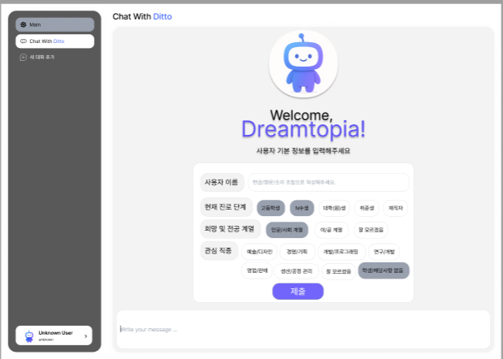
- 사용자 이름, 진로 단계, 전공 계열, 관심 직종 입력
- 맞춤형 답변을 위한 컨텍스트 수집

### Page 2: 챗봇 시작 화면
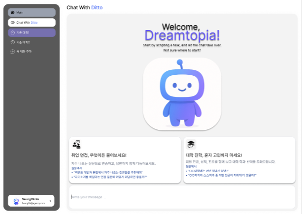
- Welcome 메시지 및 기능별 추천 카드
- 취업 면접 / 대학 진학 카테고리별 안내

### Page 3: 채팅 인터페이스
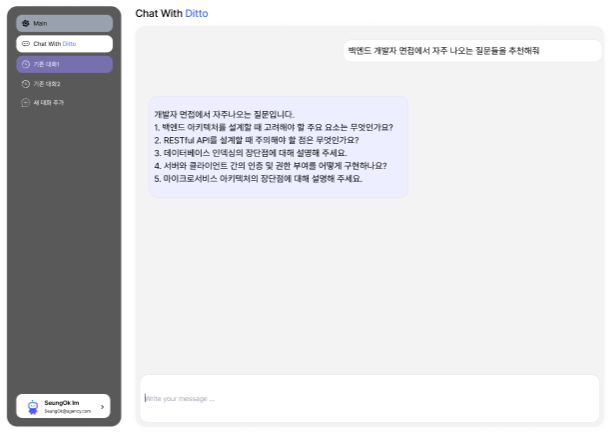
- 실시간 채팅 대화 인터페이스
- 면접 질문 추천 및 답변 피드백 제공

---

## 🚀 설치 & 실행 가이드

### 📋 Step 1: 필수 요건 확인

#### Docker 기반 실행 (권장)
- **Docker** & **Docker Compose**
- **Ollama** (로컬 LLM 실행용)
- **OpenAI API Key** (평가/생성용)

#### 로컬 개발 환경
- **Python 3.11+**
- **PostgreSQL 16** + `pgvector` 확장
- **Ollama**
- **OpenAI API Key**

---

### 📥 Step 2: 저장소 클론
```bash
git clone <repo-url>
cd SKN18-4th-2team
```

---

### ⚙️ Step 3: 환경 변수 설정
프로젝트 루트에 `.env` 파일을 생성하고 다음 내용을 입력합니다:

```env
# PostgreSQL/pgvector credentials
POSTGRES_HOST=localhost
POSTGRES_PORT=5432
POSTGRES_DB=skn4th_db
POSTGRES_USER=skn4th
POSTGRES_PASSWORD=skn4th1234

# Embedding
EMBEDDING_BACKEND=openai
LOCAL_EMBEDDING_MODEL=text-embedding-3-large
LOCAL_EMBEDDING_NORMALIZE=true
LOCAL_EMBEDDING_DIM=3072

# LLM 모델 설정
OLLAMA_MODEL=gemma3:1b
CLASSIFY_TEMPERATURE=0.2

# 평가용 모델
EVAL_MODEL=gpt-4o-mini
EVAL_TEMPERATURE=1.0

# 생성용 모델
GEN_MODEL=gpt-4o
GEN_TEMPERATURE=0.2

# 파인튜닝 모델
FINETUNE_MODEL=hf.co/rlawnsrb731/gemma3-final-skn4th:F16
FINETUNE_TEMPERATURE=0.2

# API Keys
OPENAI_API_KEY="your-openai-api-key"

# LangSmith (Optional)
LANGCHAIN_TRACING_V2=true
LANGCHAIN_ENDPOINT=https://api.smith.langchain.com
LANGCHAIN_API_KEY="your-langsmith-api-key"
LANGCHAIN_PROJECT=4th_mini_rag
```

---

### 🐳 Step 4: Docker Compose로 시스템 실행

#### 4-1. 전체 시스템 실행 (권장)
```bash
cd docker
docker compose up -d
```

**실행되는 서비스:**
- `db`: PostgreSQL 16 + pgvector (포트 5432)
- `web`: Django 웹 애플리케이션 (포트 8000)

**자동 설정 항목:**
- 초기 DB 스키마 (`college.sql`, `interview.sql`) 자동 생성
- `pgvector` 확장 자동 설치
- Django 마이그레이션 자동 실행

**확인 방법:**
```bash
# 컨테이너 상태 확인
docker ps

# 웹 서버 로그 확인
docker logs skn_web -f

# DB 연결 테스트
docker exec -it SKN_4th psql -U skn4th -d skn4th_db
```

**접속 URL:**
- 챗봇 인터페이스: http://localhost:8000/chatbot/chat

#### 4-2. DB만 실행 (로컬 개발용)
로컬에서 Django를 직접 실행하려는 경우:

```bash
cd docker
docker compose up -d db
```

그 후 로컬 환경 설정:

```bash
# 가상환경 설정
python -m venv .venv
source .venv/bin/activate  # Windows: .venv\Scripts\activate

# 패키지 설치
pip install -r requirements.txt

# DB 마이그레이션
python django/manage.py migrate

# Django 서버 실행
python django/manage.py runserver
```

---

### 📊 Step 5: 데이터 적재

> **주의**: 데이터 적재는 로컬 환경에서 실행해야 합니다. (Python 가상환경 필요)

**공통 파이프라인**: 데이터 수집 → 전처리 → 청크화 → 임베딩 (3072차원) → PostgreSQL + pgvector 저장

| 구분 | 대학/전공 데이터 | 면접 데이터 |
|------|------------------|-------------|
| **데이터 원본** | `data/college/major_details_*.csv` (7개 계열별) | `data/interview/interview_final_db.csv` |
| **청크 크기** | 500 / overlap 200 | 300 / overlap 100 |
| **특별 처리** | 학과 정보 기반 분할 | 메타데이터 추출 (`occupation`, `question_intent`) |
| **저장 테이블** | `college.college_vector_db` | `interview.meta_df` + `interview.vector` |
| **검색 방식** | 벡터 유사도 검색 | SQL 필터 + 벡터 검색 |

#### 5-1. 대학/전공 데이터 적재
```bash
python backend/ingest_data.py \
  --csv "data/college/major_details_*.csv" \
  --table college.college_vector_db \
  --chunk-size 500 \
  --chunk-overlap 200 \
  --batch-size 64 \
  --reset
```

#### 5-2. 면접 데이터 적재
```bash
python backend/embed_interview_data.py \
  --input data/interview/interview_final_db.csv \
  --schema interview \
  --chunk 300 \
  --overlap 100
```

---

### 🧪 Step 6: LangGraph 플로우 테스트 (선택사항)

```bash
python backend/service/main.py
```

```python
from backend.service.main import app

result = app.invoke({
    "user": "취업 준비생",
    "question": "백엔드 개발자 면접에서 자주 나오는 질문 추천해줘"
})

print(result["final_answer"])
```

---

### 🛠️ Docker 명령어 참고

```bash
# 전체 시스템 종료
cd docker
docker compose down

# 볼륨까지 완전 삭제 (데이터 초기화)
docker compose down -v

# 특정 서비스 재시작
docker compose restart web

# 로그 확인
docker compose logs -f web
docker compose logs -f db

# 컨테이너 내부 접속
docker exec -it skn_web bash
docker exec -it SKN_4th psql -U skn4th -d skn4th_db

# 이미지 재빌드
docker compose build --no-cache
docker compose up -d
```

---


## 💻 Web Page 구현 및 테스트 결과

### 📝 사용자 정보 입력 화면
사용자의 맞춤형 상담을 위해 기본 정보를 수집합니다.
**입력 항목:**
- 이름
- 진로 단계 (고등학생, 대학생, 취업 준비생 등)
- 관심 전공 계열
- 관심 직종

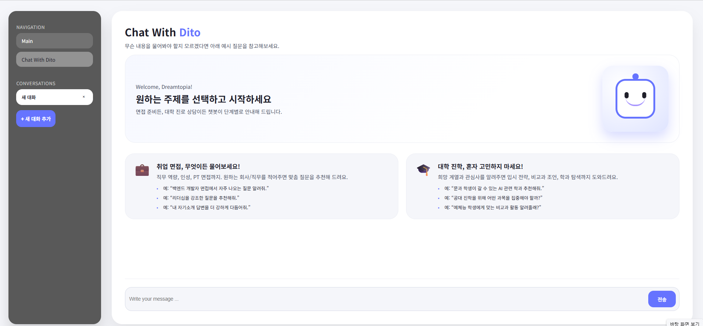
---

### 🏠 챗봇 시작 화면
사용자 환영 메시지와 함께 주요 기능을 안내합니다.

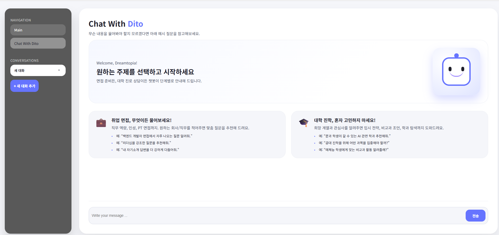


---

### 🎯 시나리오 1: 면접 질문 추천

#### 테스트 케이스
```
사용자: 취업 준비생
질문1: 리더십 관련 면접 예상질문 추천해줘?
질문2: 대기업 인성 면접 예상 질문 리스트 좀 추천해줄 수 있어?
```

#### 처리 과정
1. `classify` → 도메인: `interview` 판별
2. `interview_query_classify` → 유형: `question_recommendation` 판별
3. `interview_vector_search` → `occupation` 또는 `question_intent` 필터 + 벡터 검색
4. `interview_eval` → 청크 관련도 평가
5. `interview_generation` → 면접 질문 리스트 생성

#### 실행 결과


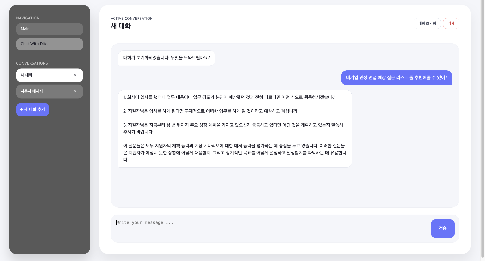

---

### 💬 시나리오 2: 면접 답변 피드백

#### 테스트 케이스
```
사용자: 취업 준비생, IT/데이터 분야
질문: 아래는 지원동기 질문에 대한 내가 작성한 답변이야! 내 답변에 대해서 피드백을 해줘! 일단 첫번째로 제가 하고싶은 일이랑 잘 맞다고 생각해서 지원했습니다.예전부터 IT쪽이랑 데이터 다루는 걸 좋아했는데, 귀사가 데이터 기반으로 서비그를 제공하고 있다는 점이 굉장히 인상 깊었습니다. 그리고 회사 규모도 크고 안정적이어서 장기적으로 커리어를 쌓는데 좋을 것 같았습니다. 또 주변 지인들 중에 귀사 서비스를 쓰는 사람들이 많은데 만족도가 높다는 이야기를 많이 들어서 자연스럽게 관심이 생겼습니다. 제가 가진 분석 능력과 성실함을 바탕으로 회사 발전에 기여하고 싶어서 지원하게 되었습니다.
```

#### 처리 과정
1. `classify` → 도메인: `interview` 판별
2. `interview_query_classify` → 유형: `answer_feedback` 판별
3. `interview_vector_search` → 유사 모범 답변 검색
4. `interview_eval` → 청크 관련도 평가
5. `interview_generation` → 답변 분석 + 개선 포인트 + 모범 답변 제공

#### 실행 결과
1. 추천 답변
2. 핵심 포인트
3. 참고 자료 분석 : 공통점, 차이점, 개선 포인트
4. 추가 연습 질문 : 유사 질문 2개 추가 제안

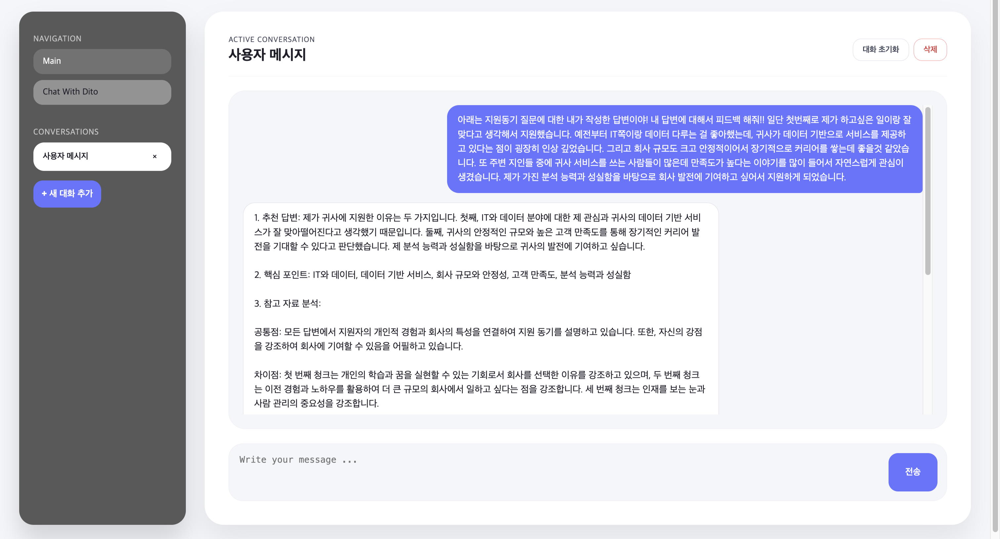
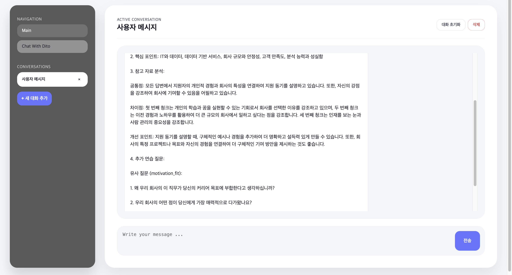


---

### 🎓 시나리오 3: 대학 학과 추천

#### 테스트 케이스
```
사용자: 고등학생
관심 계열: 이과
질문: 의예과 말고도 생명과학 계열에서 연구 중심인 학과 추천해 주세요
```

#### 처리 과정
1. `classify` → 도메인: `college` 판별
2. `classify_rag_finetune` → 방법: `rag` 선택
3. `retrieve_chunks` → 학과 정보 검색
4. `generate_answer` → 학과 추천 답변 생성

#### 실행 결과

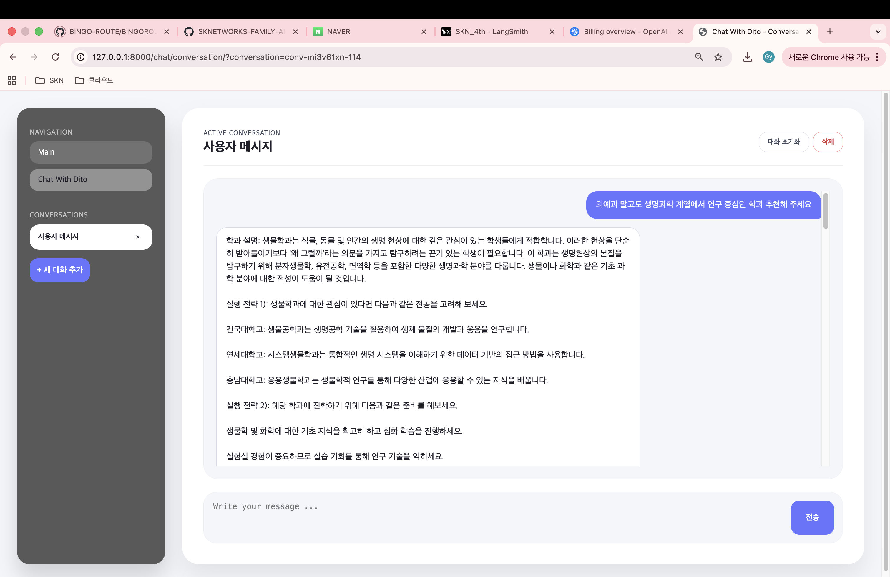
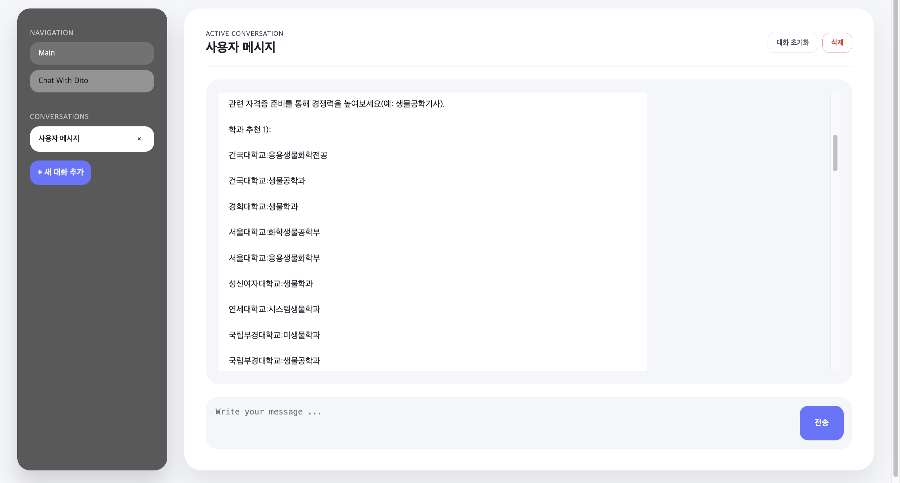


---

### 🤝 시나리오 4: 대학 진로 상담 (파인튜닝 모델)

#### 테스트 케이스
```
사용자: 고등학생
질문: 내가 공부를 너무 못하는데 하고싶은 것도 없어 어떻게 해야할까?
```

#### 처리 과정
1. `classify` → 도메인: `college` 판별
2. `classify_rag_finetune` → 방법: `finetune` 선택 (감정적 상담)
3. `generate_answer` → 파인튜닝된 Gemma-3-1B 모델로 공감적 답변 생성

#### 실행 결과

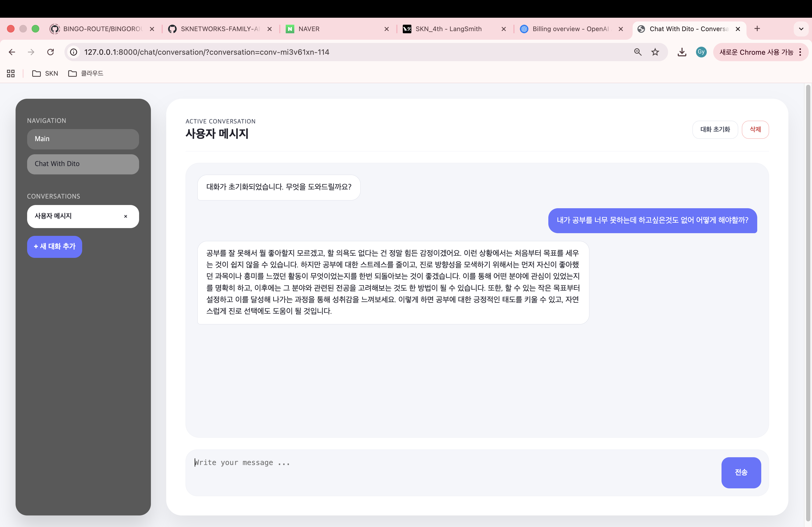


---

### ❌ 답변 불가 케이스

#### 테스트 케이스
```
질문: 나를 웃겨봐
```

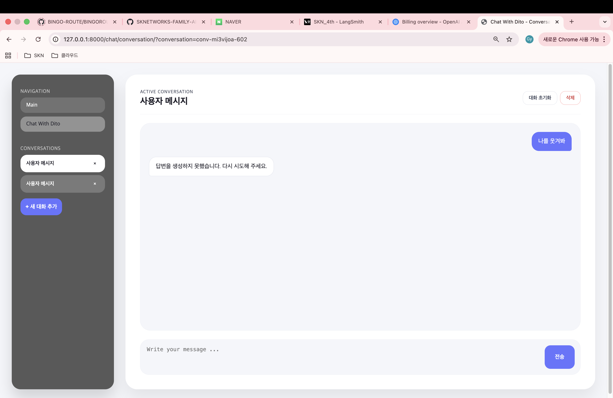

**처리 결과:**
- `classify` → 도메인: `other` 판별
- 시스템이 면접/대학 진로와 관련 없는 질문으로 판단
- 안내 메시지 제공: "답변을 생성하지 못했습니다. 다시 시도해 주세요"

---

### 📊 성능 지표
🎯 **분류 정확도:** 95% 이상 (면접/대학/기타 도메인 분류)  
✅ **사용자 만족도:** 답변 품질 및 관련성 높음


## 🙌 회고
- **김준규: 이번 단위 프로젝트에서 팀장을 맡아 전체적인 방향을 잡고 팀원들이 각자의 역할에 집중하면서도 모든 기술을 한 번씩 직접 경험해볼 수 있도록 작업 구조를 설계해줬다. 중간중간 일정이 꼬이거나 예기치 못한 문제가 생길 때마다 우선순위를 재정리하고 필요한 부분을 직접 챙기며 팀이 흔들리지 않도록 안정적으로 조율해줬다. 그 과정에서 소통과 협업을 적극적으로 이끌어 팀 분위기를 긍정적으로 유지했고, 결국 팀 전체가 성장하면서 프로젝트를 끝까지 책임감 있게 완성해냈다.** 
- **김규리: 이번 프로젝트를 통해 LangGraph로 복잡한 대화 흐름을 구조화하고, RAG 기반으로 신뢰도 높은 정보를 제공하는 챗봇을 직접 구축해볼 수 있었다. 특히 대학 전공 정보와 면접 질문 데이터를 벡터DB로 관리하면서, 데이터 품질과 검색 전략의 중요성을 크게 느꼈다. 사용자의 수준과 질문 유형에 따라 응답을 다르게 설계하는 과정에서 실제 서비스형 챗봇의 요구사항을 깊이 이해할 수 있었다. 기술적인 도전도 많았지만, 그만큼 LLM 파이프라인 설계 능력을 키울 수 있었던 의미 있는 경험이었다.** 
- **김민주: 서툴지만 직접 구현해보면서, 전체적인 흐름을 이해할 수 있었습니다. 개인적으로, 실제 구현 단계에서 불확실성이 많았고, 작은 기능 하나에도 시나리오를 명확히 잡는 습관이 필요했습니다. 이때 팀원들과의 소통이 많은 도움이 되었습니다.이번 프로젝트 경험 덕분에 기능 구현만이 아니라 협업 방식과 설계 사고까지 넓은 시야를 얻게 되었고, 다음 프로젝트에서는 초기에 구조를 더 탄탄히 잡고 팀원들 간의 소통 루틴을 정해둘 것을 다짐하게 되었습니다.** 
- **김수미: 저희 팀은 데이터 활용에 따라 RAG와 Finetuning을 맞춰서 사용한 서비스를 기획했습니다. 그러다보니 AI agent를 적재적소에 사용할 수 있도록 설계를 했고 이 경험은 추후 실무에서도 맞는 기술을 판단함에 있어 큰 도움이 될 것이라고 생각합니다. 프로젝트를 진행하는동안 이제까지 배웠던 기술들을 다양하게 사용해볼 수 있어서 너무 좋았고 모르는 부분들은 팀원들의 도움을 받아 수행함으로써 적극적인 참여와 원활한 팀워크의 중요성을 또 한 번 느끼게 되었던 프로젝트입니다.** 
- **김영우: 마지막 미니프로젝트 중 두번째 RAG 및 Langchain을 보면서 눈에 살짝 익었고 앞으로 가야할길이 구만리 제곱 인거 같아 매일을 작심삼일의 느낌으로 달리진 못해도 꾸준히 걸어간다면  1년후엔 많이 성장해 있는 저를 발견할 수 있을거란 생각에 오늘도 희망을 가지고 이 프로젝트 끝으로 Finish가아닌 현재 진행형으로 노력해 보고자 합니다!** 
- **임승옥: 이번 프로젝트에서는 채용 면접·대학 학과·상담 데이터를 바탕으로, 사용자가 어떤 질문을 할 것인가?”를 가정함으로써, 질문 유형과 사용자 정보에 따라 LangGraph 라우팅이 달라지는 RAG 시스템을 직접 설계·구현해 볼 수 있었다. 단일 플로우로 처리하던 이전 프로젝트와 달리, 이번에는 “이 질문은 면접 대비용인가, 학과 정보인가, 진로 상담인가?”, “사용자는 고등학생인지 취준생인지” 등을 먼저 구분한 뒤, 그에 맞춰 RAG 플로우와 벡터 검색 전략이 달라지도록 구성했다. 그 결과, 질문 유형별로 답변 형식과 내용이 일정하게 유지되는 경험을 할 수 있었고, 초기에 라우팅과 노드 설계를 잘 해두는 것이 얼마나 중요성을 느낄 수 있었다. 또한 LLM 파인튜닝까지 직접 시도해 보면서, 파인튜닝 → RAG와 결합에 이르는 LLM 활용 전 과정을 경험할 수 있었던 프로젝트였다.** 


---
